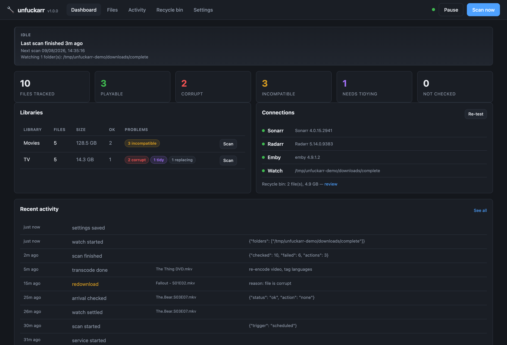
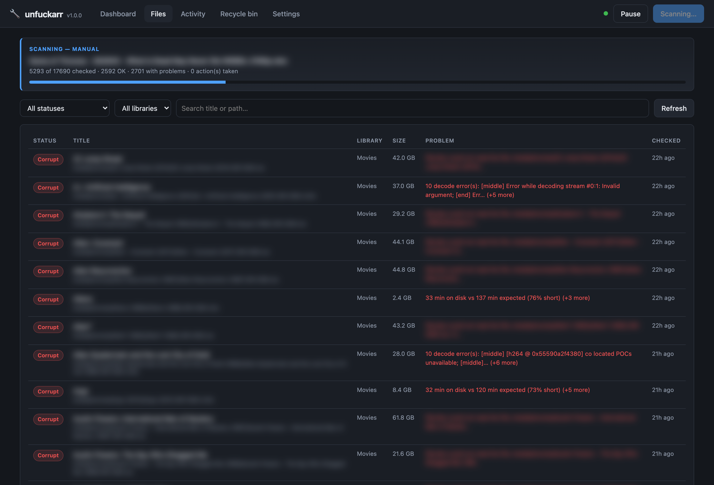
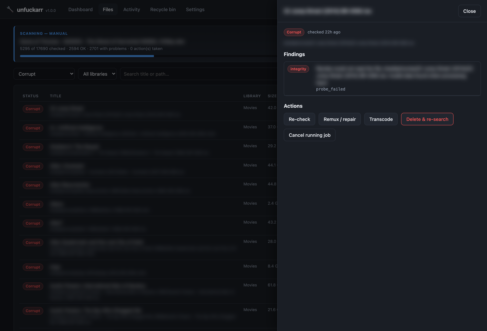
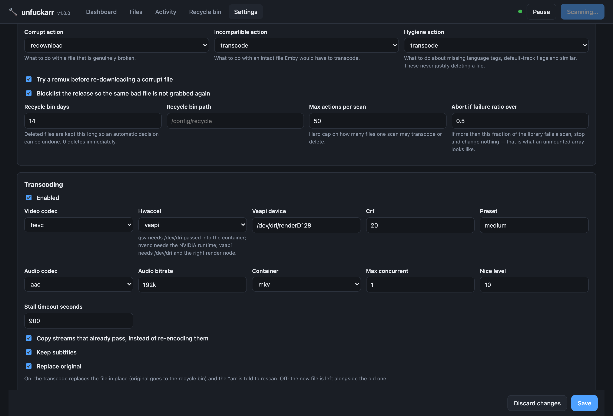

# unfuckarr

> [!WARNING]
> **unfuckarr is designed to run purely inside a [Tailscale](https://tailscale.com) tailnet (or
> another private network you trust end to end). Do not expose it to the public internet.**
> This is a service that deletes and rewrites media files unattended, its API has no
> authentication until you set a key, and its security has **not** been independently reviewed
> by a human. Bind it to your tailnet with `UNFUCKARR_BIND_INTERFACE=tailscale0` — see
> [Binding to an interface](#binding-to-an-interface) — set an API key, and keep it off the
> open internet. No reverse proxy, no port forward, no "it's fine, it has a password".

> **AI-assisted project.** This codebase was created with [Claude Code](https://claude.com/claude-code).
> The check engine, the transcode planner, the policy brakes and the recycle bin are covered by a
> test suite that runs against real files rendered by ffmpeg on every push — and since 1.0.0 it
> has been used live: a real Sonarr, Radarr and Emby setup has been connected, and real repairs
> (remuxes, recycling, delete-and-re-search) have run against a live 17,000-file library.
> Hardware-accelerated encoding and the Unraid template install remain unexercised. On *your* library, still start
> with the actions set to `flag`, look at what it found, and only then let it act.

Scans a Sonarr/Radarr library, works out which video files are broken or which Emby cannot
direct play, and fixes them — by transcoding, by remuxing, or by deleting the file and asking the
*arr for a better copy.

Runs as a Docker container with a web UI. Packaged for Unraid Community Applications.



---

## What it checks

Five independent classes of problem, each with its own remediation policy.

**Integrity — is the file actually intact?**
ffprobe refuses it, the container has no duration, there is no video or audio stream, the file is
a stub, or a decode pass over the start, middle and end produces errors. Also: the file is
*shorter than the runtime Sonarr or Radarr expects*, which catches a truncated download that
decodes perfectly for every byte it does have.

**Emby direct play — will it play without cooking the server?**
An intact MPEG-2 AVI is not broken; it is just transcoded on every single play, and a weak client
fails outright. When an Emby server is configured, unfuckarr does not guess: it calls
`POST /Items/{id}/PlaybackInfo` with a device profile describing your target client and reads
Emby's own `TranscodeReasons` back. That accounts for your server's version, its ffmpeg build and
its remux rules in a way a local codec table never can. Without Emby, a local profile model is
used instead — `modern`, `conservative` (Chromecast-class), `permissive`, or a custom list.

**Stream hygiene — will it behave?**
Missing audio language tags, no default track among several, image-only subtitles (which force a
video transcode whenever they are switched on), every subtitle flagged forced, odd frame rates.
None of this is breakage, so hygiene findings can never trigger a delete — the config type does
not permit it.

**Disc images — .iso and .img are read, not condemned.**
`ffprobe` cannot open a disc image. Handed one it says *"Invalid data found when processing
input"*, which is indistinguishable from a genuinely broken file — so a library full of BR-DISKs
gets queued for delete-and-re-search. unfuckarr opens them instead, without mounting anything and
without any privilege the container does not already have:

- **Blu-ray** via ffmpeg's `bluray:` protocol. libbluray bundles libudfread and reads the UDF
  filesystem straight out of the image, then presents the longest playlist. Seeking works, which
  is what makes the quality search usable on a disc.
- **DVD** by parsing the ISO9660 directory in Python to find the title VOBs, then handing ffmpeg
  each one as a byte range of the image through the `subfile` protocol. (Debian's ffmpeg is built
  without libdvdread, so there is no `dvd:` protocol to use.)

From there a disc behaves like any other file: it is checked for integrity, measured for
efficiency, and — because an 80 Mbps disc is the best shrink candidate in any library —
re-encoded to a normal `.mkv` that every client can direct play.

**Converting a disc image, with MakeMKV.** Reading an image is enough to judge it and not enough
to convert it: the feature on a Blu-ray is a *playlist* naming a sequence of segments, and taking
the largest one instead picks a trailer on some discs. Point unfuckarr at a MakeMKV and it will
copy the main feature out properly — stream copy, so the same video and the same lossless audio,
with the chapters and every subtitle track — put the bonus features in an `extras/` folder beside
it where Emby looks for them, and recycle the image once the result verifies. Nothing is
re-encoded; if you also want it smaller, the ordinary shrink path takes it from there, measured
at both ends like anything else.

**The menus do not survive, and nothing you use ever played them.** No Matroska file can hold a
DVD or Blu-ray menu — MakeMKV does not preserve them either — so a conversion trades the
navigation for a file Emby can index. Emby has never rendered a disc menu; handed an image it
picks a title and plays it. What the menus were *for* — the other audio tracks, the subtitles,
the deleted scenes — all comes across.

**MakeMKV is not included, and cannot be.** Its binary half is not redistributable, and its beta
key expires roughly monthly, which is not something an unattended service should depend on. So
`makemkv.command` is a whole command line you provide — `makemkvcon` on the PATH, or a
`docker run ... makemkvcon` shim naming a container that has it. If you use a container, mount
your media at *the same paths* it has here, or MakeMKV is handed a path that does not exist and
reports only that it cannot open the disc.

**An image nothing can open is reported, never condemned.** It raises an *info* finding, not an
error, and no policy acts on it. Being unable to read a file is not evidence that the file is bad,
and this is the one place in the application where confusing those two has already cost real
media.

**Efficiency — how small could this be, really?**
A 38 Mbps H.264 Blu-ray remux is a perfectly good file; the only thing to be said against it is
that it is four times the size of an HEVC encode nobody could tell apart from it. So every file
above a worthwhile-size floor is *measured* — there is no bitrate threshold deciding in advance
which ones are "too big", because a threshold is a guess about how an encoder will behave on
content it has not seen, and it is wrong in both directions: it condemns grain-heavy 35mm that
will not compress at all, and waves through a lazily-encoded 1080p whose picture fits in a third
of the space.

Files awaiting that measurement read as *not yet measured* — a statement about what has been
checked, not a claim about the file. Every one ends in one of two terminal states (shrunk, or
measured and left alone), both recorded permanently, so the backlog drains and the count is real
progress. This is the one check that is not looking for a fault, and it is carried separately all
the way through: nothing it raises is ever an error, it can never reach a policy that deletes,
and it is excluded from the failure-ratio abort below.

**Emby's activity log.** Real playback failures the server recorded, for files that otherwise
look fine.

Every file lists what is wrong with it, worst first:



…and each one opens on the findings, the actual stream layout, and the actions you can take by
hand:



## What it does about it

| Finding | Default action |
|---|---|
| Container damage only (index, atom order, bad timestamps) | Remux — seconds, lossless. Falls through to re-download if the remux fails or its output does not verify. |
| Genuinely corrupt | Delete, blocklist the release, trigger a new search |
| Intact but Emby would transcode | Transcode, copying every stream that already passes |
| Hygiene | Flag only |
| Not yet measured for a saving | Measure it, and re-encode only if the result is smaller *and* still scores at the quality target |
| A disc image nothing can open | Report it, and do nothing |
| A disc image, with MakeMKV configured | Copy the feature out to `.mkv`, bonus features to `extras/`, recycle the image |

Everything is configurable per class, including turning it off.

**Transcoding copies what it can.** A compatible H.264 stream in the wrong container is a remux,
not a re-encode — getting that wrong turns twenty seconds of work into six hours. Only the stream
that actually fails gets re-encoded. Output is verified (streams present, duration within 2% of
the source) before it is allowed to replace anything.

**Shrinking is measured, not guessed.** This is the only thing unfuckarr does to a file that
nothing is wrong with, so it is not allowed to guess — about which files to touch, or about what
the result looks like. CRF is not a quality level; it is a rate-control knob whose meaning
depends entirely on the content, and the CRF 22 that is visually lossless on a talking-heads
documentary is mush on grain-heavy 35mm. So instead of picking a number and hoping:

1. Three short samples are taken from across the file (skipping the head and tail, where logos
   and credits compress unlike anything else).
2. Each is encoded at a candidate CRF and **scored against the source with VMAF**, and a
   bisection finds the *largest* CRF — the smallest file — that still meets the target. Largest,
   not safest: a lower CRF always passes and always saves less.
3. If the projected saving does not clear `min_saving_pct` (default 25%), nothing is encoded.
4. After the full encode, the finished file is measured again, on the same windows, against the
   original. If it is not actually that much smaller, or if it does not still score at the
   target, **the output is deleted and the original is kept**. That is a normal outcome for a
   lot of files and is not a failure.
5. A file that has been shrunk is never shrunk again, and one that has been assessed and left
   alone is not reassessed — both are recorded permanently. Re-encoding an encode is a second
   generation of loss for a fraction of the saving, and re-deciding "not worth it" costs hours
   of CPU to reach the same answer.

The saving is whatever the measurement finds. A file that halves because H.264 became HEVC and
a file that halves because it was over-encoded to begin with are the same outcome as far as this
is concerned — the only questions asked are "is it meaningfully smaller" and "does it still score
at the target".

Quality tiers are VMAF 85 (*acceptable*), 92 (*good*, the default) and 95 (*excellent*). Only
HEVC is produced: Emby direct play is the premise of this whole application, and shrinking into
a codec your target profile rejects would trade a size win for a file Emby has to transcode on
every play. HDR is skipped unless you ask for it — a re-encode that loses the metadata produces
a grey, washed-out file that still plays, which is the worst kind of failure because nothing
reports it.

> **VMAF needs an ffmpeg that has it, and no distribution ships one.** Not Debian bookworm, not
> Debian trixie, not jellyfin-ffmpeg. The container therefore includes a second, static ffmpeg
> (`ffmpeg-vmaf`) used *only* for scoring — Debian's ffmpeg still does all the encoding, so the
> hardware path is untouched. Running from source without one, unfuckarr falls back to ffmpeg's
> built-in SSIM filter and says so in the UI: it does catch gross quality loss, but it correlates
> less well with what a person sees, so the thresholds are approximate rather than a measurement.

> **Shrinking fills the recycle bin.** The original of every shrunk file is kept for
> `recycle_bin_days` (default 14). At five shrinks a scan on a library of 40 GB remuxes that is
> several hundred gigabytes held back from the array at any time. Lower the retention, or the
> per-scan cap, if that is not room you have.

**Deleting goes through the *arr, not `os.unlink`.** Removing a file behind Sonarr's back leaves
the episode marked present until its next rescan. unfuckarr deletes via the API, then marks the
grab failed — which blocklists the release *and* queues a search, so the indexer does not hand
back the same broken file within the hour.

## The brakes

Unattended deletion needs to be wrong safely, so there are three layers:

- **Recycle bin.** Deleted and replaced files move to a dated directory and are recorded.
  Retention defaults to 14 days and any entry can be restored from the web UI. Set it to 0 to
  unlink immediately.

  **Put the bin inside your media mount.** Set `UNFUCKARR_RECYCLE_BIN_PATH` (or the Recycle bin
  field in the Unraid template) to something like `/media/.recycle`. On the same filesystem as
  the media, recycling a file is a *rename* and costs nothing; anywhere else it is a full copy of
  every deleted file. The old default, `/config/recycle`, is the wrong place for exactly that
  reason — on Unraid `/config` is appdata on the cache, so every recycled 40 GB remux is copied
  onto the cache and kept there for the retention window. unfuckarr never scans its own bin, so
  it is safe to keep it inside the library. The dashboard shows where the bin actually is, and
  says so loudly if it is not writable.
- **Action cap.** No single scan may act on more than `max_actions_per_scan` files (default 50).
  Shrinking is not rationed this way at all — see below — so a long re-encode can never consume
  the pass that a corrupt file is waiting on.
- **Failure-ratio abort.** If more than half a library fails one pass, the scan stops and changes
  *nothing*. That is what an unmounted array looks like, and it is the failure mode that costs
  people their library. Shrinks are deliberately *not* counted here: an unmounted array produces
  integrity failures, a file ffprobe cannot read never reaches the efficiency check at all, and
  counting them would trip the brake permanently on any library that is mostly H.264 — which is
  most libraries.

All of it is on one settings page, with every option explaining what it actually does:



## Pacing, not rationing

Shrinking runs **continuously**, on its own worker, for as long as the service is up. It takes
the fattest unmeasured file, measures it, acts or declines, and moves to the next one. That is the
only shape that fits a real library: at a quarter of an hour or more per file, a nightly batch of
five takes years, and a batch big enough to matter is a scan that runs all day and blocks
everything behind it.

What stops that from ruining the server is a **governor on the GPU's video encode engine**, not a
file count. Linux reports per-process DRM engine time in `/proc/<pid>/fdinfo`; sampled over a
wall-clock interval, `drm-engine-enc` is a direct percentage. unfuckarr reads its own encoder's
share and holds it at `gpu_encode_percent` (default 50) by pausing and resuming the process, so
half the encode engine is always there for Emby.

Measured on a Radeon 880M: flat out, a 4K HEVC encode reports **958 ms of engine time per
wall-second**; `SIGSTOP` takes that to a true **0**; `SIGCONT` returns it to **966 ms/s** and the
finished file is valid. Asked for 50% of the engine, the governor settles at **50.5%**; asked for
25%, at **27.0%**. The two obvious metrics — `gpu_busy_percent` in sysfs and `VCN Load` in
debugfs — both read **0** throughout that same encode, so fdinfo is not merely the nicest option,
it is the only one that works.

The governor is inert for software encodes: there is no encode engine to share, and `nice_level`
already handles being polite about the CPU. Set `only_between_hours` if you would rather the work
only happened overnight.

## Watch folders — the live import gate

Point a watch folder at your completed-downloads directory and every new video file is checked
the moment it lands, before the *arr imports it. That is the cheapest possible time to reject
something: nothing has been imported, and Sonarr will simply grab another release.

The hard part is knowing when a file has *finished* landing. A copy still in progress and an
unpacking rar are indistinguishable from a truncated download if you probe them too early, so
each event starts a settle timer that resets on every further write; the probe only runs once the
size has held steady (60s by default). `.part`, `.!qb`, `.crdownload` and friends are ignored
outright.

Unraid user shares are SMB/NFS and deliver no inotify events, so unfuckarr detects a network
mount and polls instead. Force it either way with `UNFUCKARR_WATCH_POLL=1` / `=0`.

## Install

### Unraid

Community Applications → search **unfuckarr**. Set the media path to the *same path your *arrs
use*, or fix it afterwards with path mappings in Settings.

Or add the template by hand: `unraid/unfuckarr.xml` in this repo.

### Docker Compose

```bash
docker compose up -d
```

See [docker-compose.yml](docker-compose.yml). Then open `http://<host>:6969`.

Image tags:

| Tag | Means | Architectures |
|---|---|---|
| `latest`, `1.0.0`, `1.0` | the newest release | amd64 + arm64 |
| `edge` | current `main` | amd64 only |
| `sha-abc1234` | one specific commit | amd64 (arm64 too, on releases) |

arm64 is emulated at build time and ships no VAAPI drivers, so there is no hardware transcoding
there. `edge` is amd64-only because building arm64 under QEMU on every push is not worth the
minutes — which is also why `latest` never points at a `main` build.

### From source

```bash
pip install -r requirements-dev.txt
UNFUCKARR_CONFIG_DIR=./config python -m unfuckarr
```

Needs `ffmpeg` and `ffprobe` on `PATH`.

## Configuration

Everything is on the settings page and written to `/config/config.json`. Environment variables
(`UNFUCKARR_SONARR_URL`, `UNFUCKARR_SONARR_API_KEY`, `UNFUCKARR_RADARR_*`, `UNFUCKARR_EMBY_*`,
`UNFUCKARR_WATCH_FOLDERS`, `UNFUCKARR_API_KEY`, `UNFUCKARR_PORT`) seed it and **override the saved
file on every start** — set them once to bootstrap, then remove them. `UNFUCKARR_HOST` and
`UNFUCKARR_BIND_INTERFACE` (below) control the bind address and are env-only.

### Binding to an interface

By default the server binds `0.0.0.0` — every interface it can see. Two variables narrow that:

- `UNFUCKARR_HOST` — a literal address to bind, e.g. `100.64.0.5`.
- `UNFUCKARR_BIND_INTERFACE` — an interface *name*, e.g. `tailscale0`. Its IPv4 address is
  looked up at start, so the binding survives the address changing. Startup **waits** for the
  interface to appear (60 s, tune with `UNFUCKARR_BIND_WAIT`) and then fails rather than
  falling back to `0.0.0.0` — a VPN that comes up a few seconds late must not mean a service
  that is briefly listening everywhere. Takes precedence over `UNFUCKARR_HOST`.

This is how you pin unfuckarr to a [Tailscale](https://tailscale.com) tailnet permanently:
`UNFUCKARR_BIND_INTERFACE=tailscale0` and it is unreachable except through Tailscale, even from
the LAN.

Neither variable appears on the settings page, and that is deliberate: the bind address is
consumed before the web server exists, and a wrong value saved through the UI would take down
the exact UI you would use to fix it. Set them where the container is configured — compose file,
or the container's edit page on Unraid.

The Docker catch: a process can only bind an interface that exists inside its own network
namespace. In the default bridge network the container cannot see the host's `tailscale0` —
there, control exposure from the host side instead, by publishing the port on the tailscale
address (`"100.64.0.5:6969:6969"` in `docker-compose.yml`'s `ports`). `UNFUCKARR_BIND_INTERFACE`
is for the setups where the interface genuinely is in the container: `network_mode: host`, a
Tailscale sidecar container sharing the network namespace, Unraid's per-container Tailscale
toggle (Edit container → enable Tailscale — which runs `tailscaled` inside the container, so
`tailscale0` is there to bind), or a source install.

**Path mappings are the thing that goes wrong.** Sonarr reports `/tv/Show/S01E01.mkv`; if this
container mounts the same file at `/media/tv/...`, every lookup misses and the whole library reads
as missing. Either mount media at the same path the *arrs use, or add `/tv = /media/tv` under the
relevant service in Settings.

### Hardware transcoding

Pass `/dev/dri` into the container and set the accelerator in Settings → Transcoding:

| Setting | Needs |
|---|---|
| `qsv` | Intel iGPU, `/dev/dri` passed through |
| `vaapi` | `/dev/dri`, correct render node (`vaapi_device`) |
| `nvenc` | NVIDIA container runtime |
| `videotoolbox` | macOS host, source install only |

The amd64 image ships the Intel and Mesa VAAPI drivers. **The arm64 image ships neither** — there
is no hardware transcoding on ARM.

**`vaapi` is tested on real hardware** — an AMD Radeon 880M (gfx1150), where a 1080p MPEG-2
source re-encodes to HEVC at about 12× realtime through unfuckarr's own transcode path. Mesa
comes from bookworm-backports precisely for this: Debian's stable Mesa knows no AMD GPU newer
than RDNA2 and fails with `amdgpu: unknown (family_id, chip_external_rev)` on anything newer,
with the card sitting right there in `/dev/dri`.

`qsv`, `nvenc` and `videotoolbox` are still command-line construction only — no Intel, NVIDIA or
macOS hardware has run them. `none` (libx264) remains the default.

Note that hardware *decode* is not required and not requested: the file is decoded in software
and uploaded to the GPU for encoding. The sources this tool exists to fix are often ones modern
GPUs no longer decode at all — no recent AMD part has an MPEG-2 decoder — and asking the GPU to
filter frames it never decoded fails partway through the file rather than at startup.

## Development

```bash
python -m pytest tests -q
```

The suite renders real clips with ffmpeg rather than mocking the probe, because the interesting
bugs are in what ffmpeg actually says about a file. Tests that need ffmpeg skip cleanly without it.
The *arr and Emby clients are tested against `httpx.MockTransport`.

The screenshots above are captured from a live instance mid-scan of a real library, with
anything naming real media blurred at capture time. To work on the UI without three real
servers, there is a demo pipeline — `demo_services.py` stands in for Sonarr, Radarr and Emby:

```bash
python scripts/demo_services.py &
UNFUCKARR_CONFIG_DIR=./demo python scripts/seed_demo.py --with-services
UNFUCKARR_CONFIG_DIR=./demo python -m unfuckarr
```

`demo_services.py` is a real HTTP stub answering the handshake endpoints, so the connection panel
going green means the client code genuinely worked rather than a flag being set.

## API

The whole UI runs on the JSON API at `/api`, documented at `/api/docs`. Set an API key in Settings
to require `X-API-Key` (or `?apikey=`) on every call; unset means no auth, which is only tolerable
because the service is assumed to be reachable from inside your tailnet and nowhere else. It is a
brake against accidents, not a security boundary — see the warning at the top.

## Licence

MIT — see [LICENSE](LICENSE).

*Not affiliated with Sonarr, Radarr, or Emby.*
